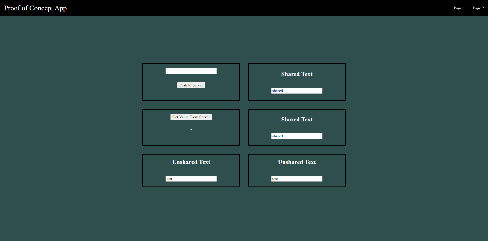
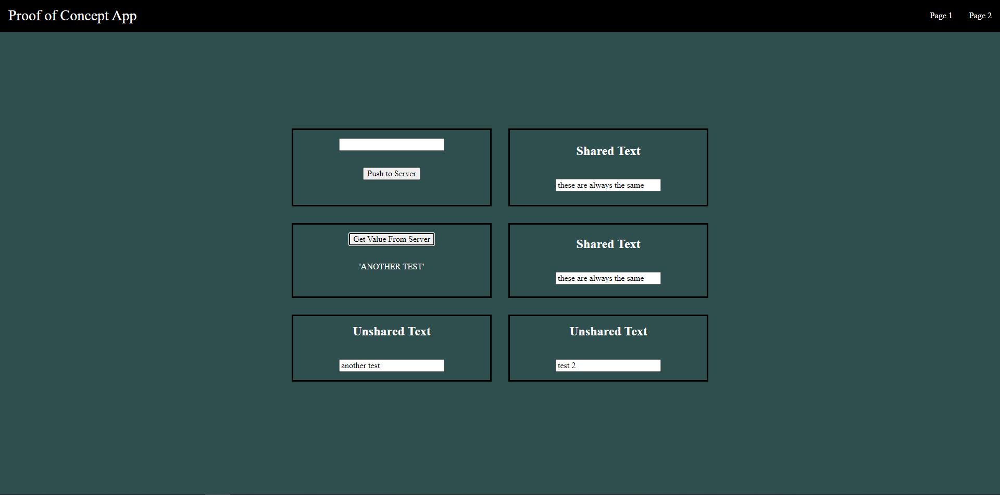

# Full Stack Proof of Concept App

The app itself is not supposed to be anything special,
but it contains all of the components of a complete full-stack application:

- Frontend
    - Components
    - Styling
    - Page Routing
    - State Management
- Backend
    - Server Runtime
    - APIs
    - Database




There are a lot of big words surrounding full-stack development so try not
to be put off by it if you are new.  
Here are the basics:

- A client is a computer program that runs on the end-user's machine. When
you want to buy something online, you are the user and your device is the
client.

- A server is a computer that an organisation uses to share data. Usually
this is done through a Server Runtime - a program that listens for requests
and can perform logic before responding.

- When you want to buy something online, there is a client-side (frontend)
application responsible for everything you see and interact with. When
you search for a product or place an order, the client-side application
needs to communicate with a server-side (backend) application so that the
request can be processed centrally. This communication occurs using APIs
(Application Programming Interfaces) - I don't find the acronym to be very
useful, but it's basically just a set of rules for how different
applications can communicate. This is called the Client-Server model.

--

- If the server-side application stops due to an error,
upgrade/maintenance, or for any other reason, all data will be lost because
the server-runtime works in memory. We need to use a Database to store
data permanantly. Databases are also good because the server will interact
with a huge amount of data during its runtime and it doesn't make sense
to keep it all in memory at once.

- When designing a frontend application, it's useful to break things down
into components - chunks of code that are responsible for themselves and
their contents. Components can take in props to enable reusability. When
you want to buy something online and you're looking through all of the
entries, those entries are all different instances of the same component.
This means that they behave the same, they just may be provided with
different data.

- Styling is to do with positioning, sizing, colouring, fonts, and more.

- Usually when you click a link to go to a page, the whole page has to load
from scratch. Page Routing is done within a site to prevent certain
components from re-rendering if they are to be reused. For example, you
might want to keep the search bar component where it is when you switch
from one category page to another.

- State Management is about how to manage data that is shared between
different components. For example, when you want to buy something online,
the site you're using might have a basket icon on every page that has a
number indicating how many things you've got in your basket. On a product
page you will need to access that same data to add a new product. On the
purchase page you need to see a list of things in the basket. These are all
completely different areas of the site that need access to the same state.
This can be quite difficult to do without a dedicated State Management
solution.

Tech Stack:
- React
- Redux
- CSS
- C#
- SQLite
- Dapper

Skills:
- Frontend
    - React
    - Redux
    - CSS
    - React Router DOM
    - Components
    - State Management
    - Page Routing
    - Styling
- Backend
    - C#
    - SQLite
    - ASP.NET Core
    - Web APIs
    - Services
    - Database Interaction
    - Relation Databases
    - SQL
- Other
    - MVC
    - Git
    - GitHub


```bash
mkdir FullStackPoC
cd FullStackPoC

dotnet new sln --name FullStackPoC
dotnet new webapi -o Backend
dotnet sln add .\Backend\
# create .gitignore

npm create vite@latest
# Ok to proceed? `y`
# Project name: `frontend`
# Select a framework `React`
# Select a variant `TypeScript`
cd frontend
npm i

cd ..

git init
git add .
git commit -m "init"
git remote add origin https://github.com/BenTaylor25/FullStackPoC.git
git push origin master
```

NPM Pacakges:
```bash
cd frontend

npm install react-router-dom
npm install @reduxjs/toolkit react-redux
```

NuGet Packages:
```bash
cd Backend

dotnet add package ErrorOr --version 0.1.0
dotnet add package Dapper --version 2.1.35
dotnet add package System.Data.SQLite --version 1.0.118
```
